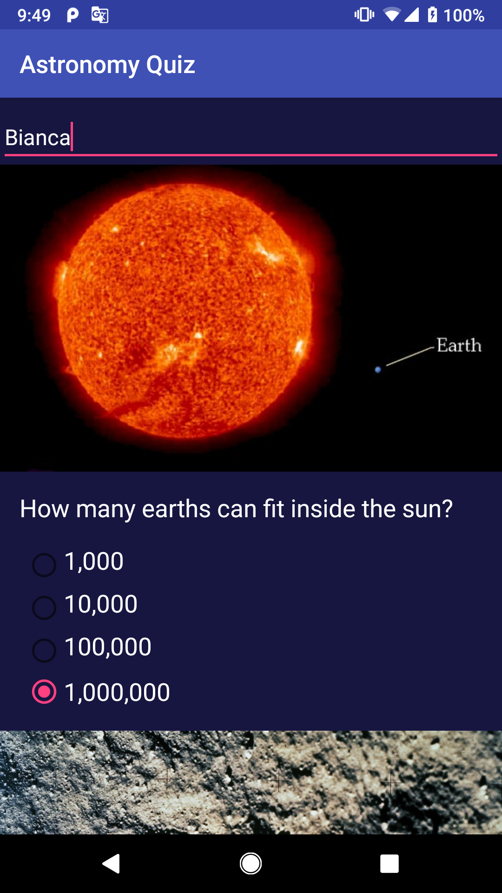
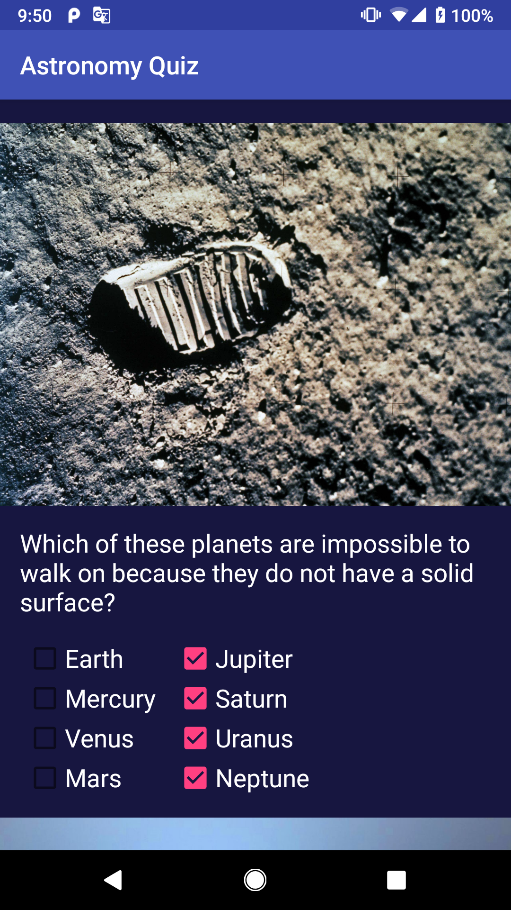
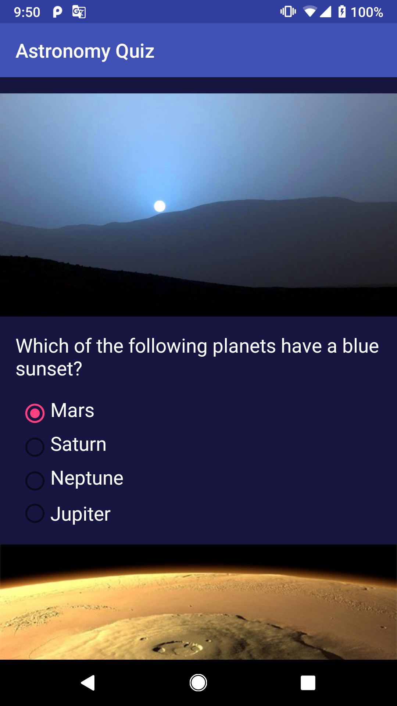
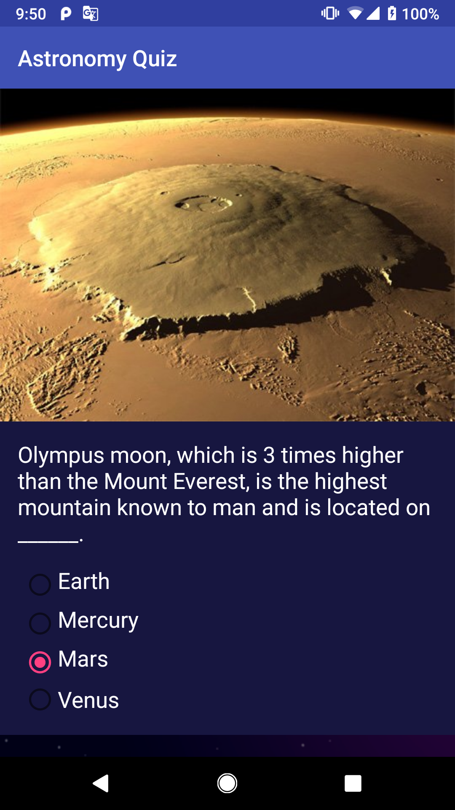
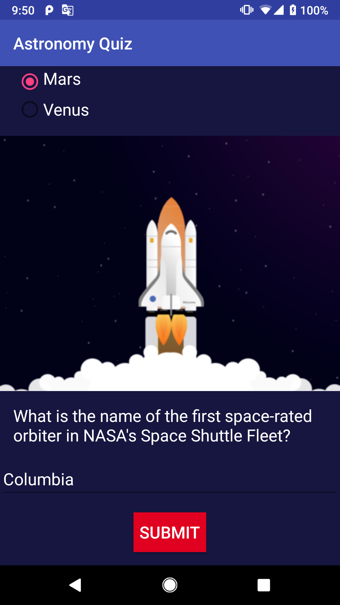
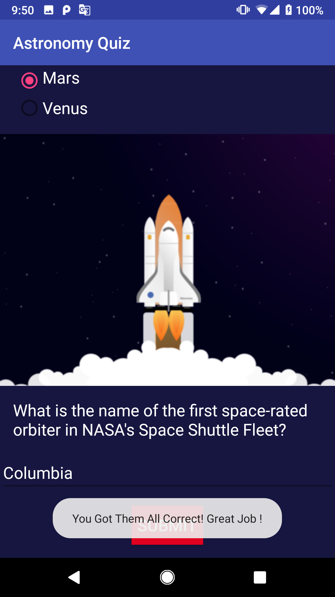
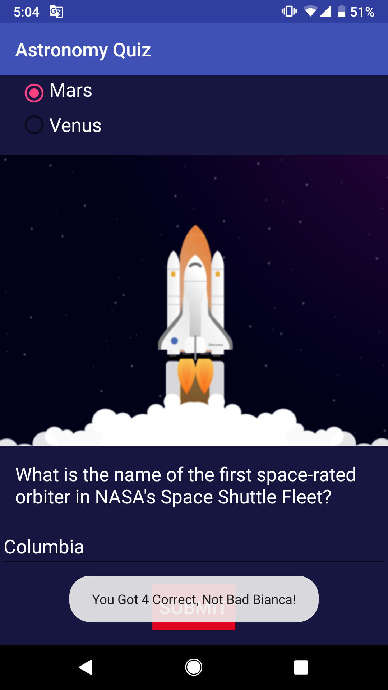
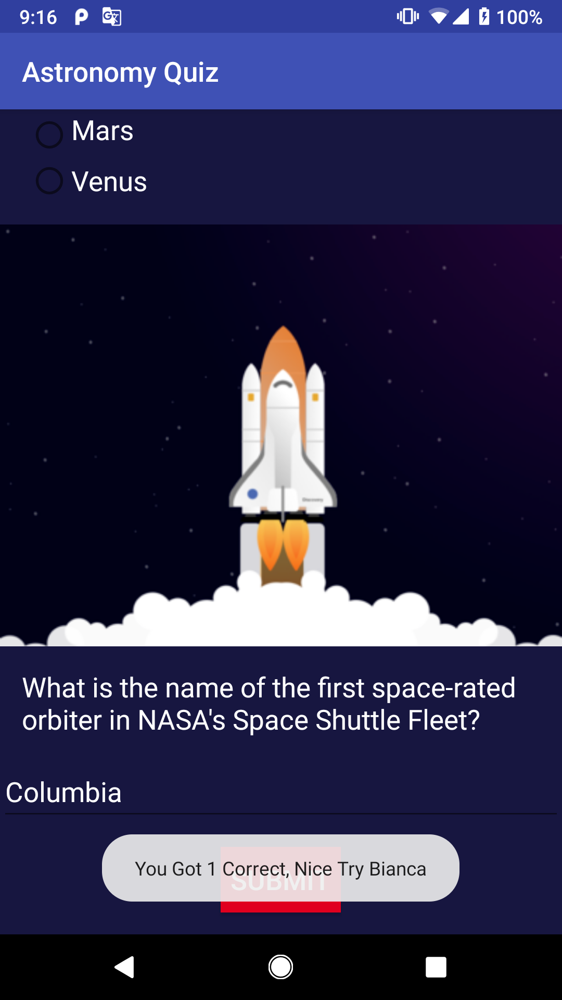

# AstronomyQuiz

<b> A single screen educational app that quizzes the user about Astronomy</b> 

 Project #3 for the <b>Android Basics Nanodegree</b> by Google 

 This app focuses on user input. I designed a quiz layout and implemented it in my astronomy app by formatting the questions in a xml
layout file. Questions are in a variety of formats such as free text response, checkboxes, and radio buttons. Questions that use radio 
buttons only allow the user to check one at a time. Check box questions checks that the correct answers are checked and the incorrect 
answers are not checked. The text entry question checks that the user enters the correct string. The submit button checks the user's answers 
and a toast message displays the user's score. If the user enters their name, the toast message displays their score along with their name
for a more personalized feedback. The astronomy quiz app uses nested ViewGroups to reduce the complexity of the layout. 
The scrollable feature allows the app to gracefully handle displaying all the content on screen when rotated. 

Core Concepts I learned Completing this Project:
----------------------------------------------
-	Adding button code to apps
-	Updating views
-	Properly scoping variables
-	Finding views by their ID
-	Creating, positioning, and styling views
-	Creating interactivity through button clicks and Java code.

 
 
 
 
